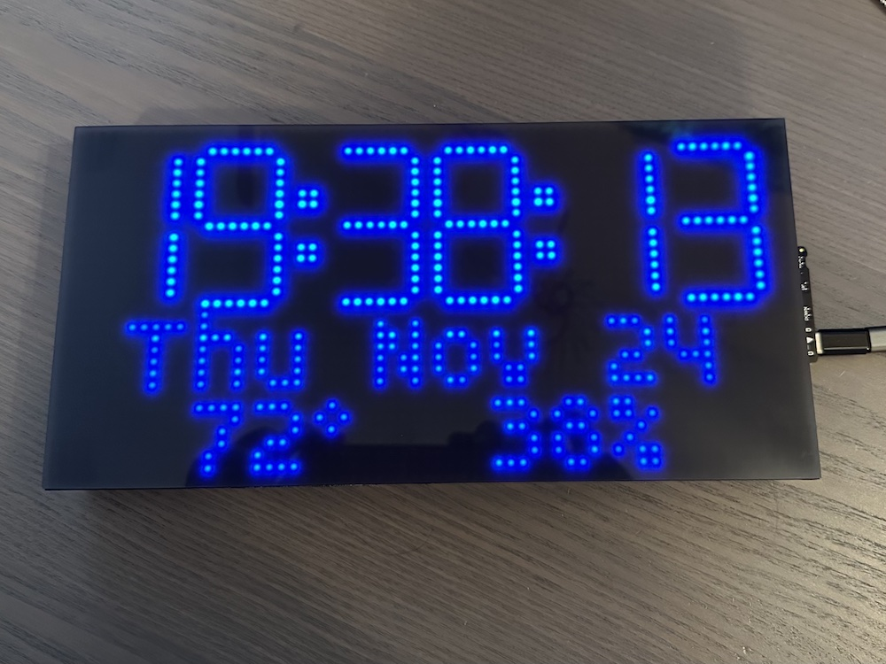

# MatrixPortal_MorphingClock

This is an updated version of [@brianmwhite/MatrixPortal_MorphingClock](https://github.com/brianmwhite/MatrixPortal_MorphingClock)
to make it compatible to CircuitPyton 9.2.

The upstream project is a CircuitPython port of [@hwiguna/HariFun_166_Morphing_Clock](https://github.com/hwiguna/HariFun_166_Morphing_Clock)

From the original:

> Read what this code is all about on [Instructable](https://www.instructables.com/id/Morphing-Digital-Clock/).

The initial port/fork of that project to CircuitPython is [brianmwhite / HariFun_166_Morphing_Clock](https://github.com/brianmwhite/HariFun_166_Morphing_Clock)

Lemon bitmap font from [cmvnd / fonts](https://github.com/cmvnd/fonts)

